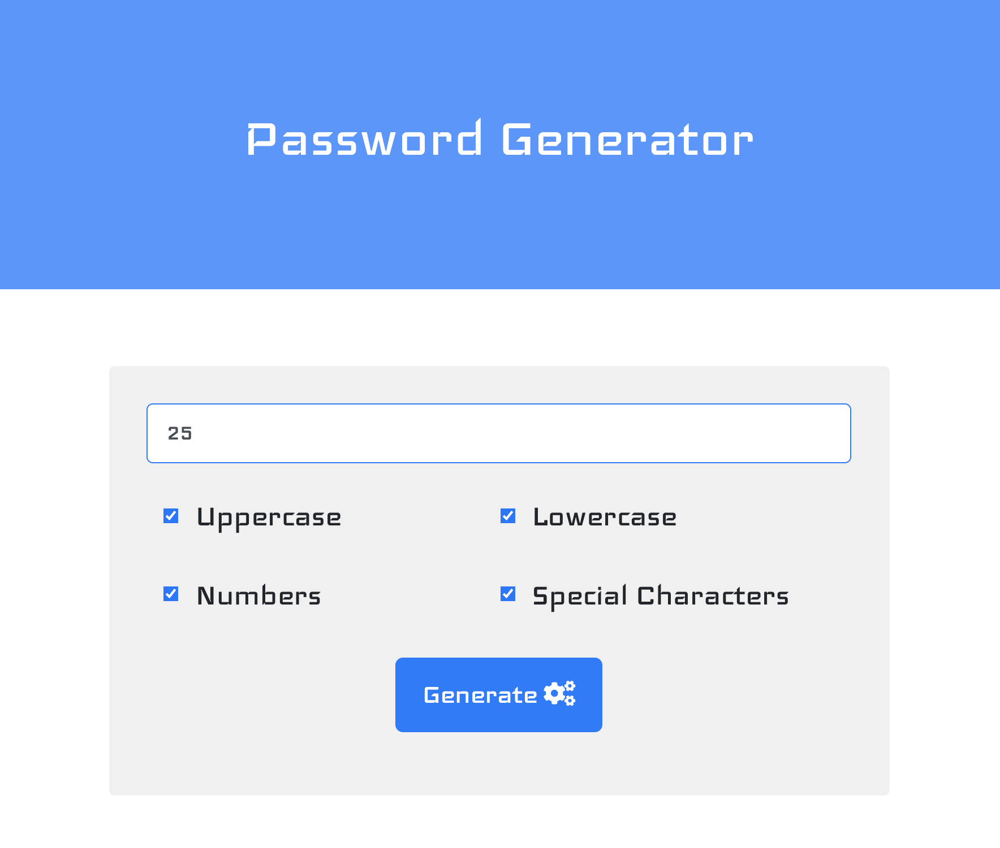

# Password Generator

### Deployed Application 

[Password Generator](https://mhans003.github.io/passwordgenerator/)

### Description 

This program runs an algorithm that outputs a randomly generated password to the user. 

The user is asked for two preferences (password length and character type), and the program utilizes unique character codes corresponding to the user's choices to randomly generate a new secure password upon each iteration. 

### Features

* Responsive to screen sizes across devices. 
* Incorporates Bootstrap utilities including container, modal, and buttons. 
* ClipboardJS allows for generated password to be instantly copied. 
* Font Awesome icons support a more satisfying layout. 

